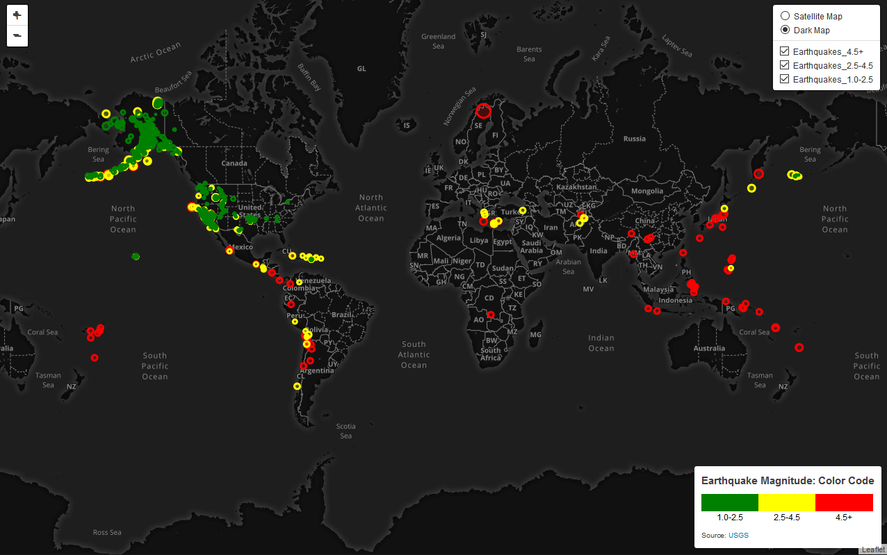

# Visualizing Earthquake Data with Leaflet

# Description
JSON data from the USGS on earthquakes from various regions across the globe were visualized on a graphical map.
The JSON repository for USGS URL: http://earthquake.usgs.gov/earthquakes/feed/v1.0/geojson.php.
Intensity of the earthquake was annotated by color coding and size of the circle marker. Clicking on any of the 
earthquake map data markers displays relevant data for that seismic event.

# Deployment
The leaflet-challenge webpage is self-contained on GitHub. Click the URL below to load the page into your current browser. 
Note that the user-interactive features may react differently depending on browser. I have tested Firefox and Chrome. 

# Tools
HTML, CSS, JavaScript, D3, Leaflet

# URL
https://stevenjbark.github.io/leaflet-challenge/
